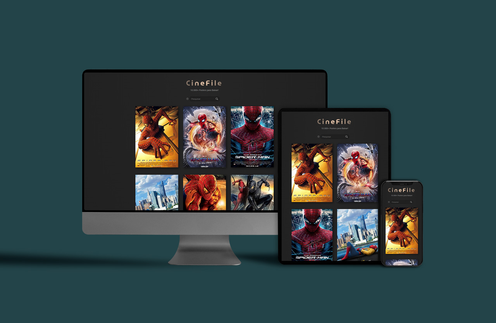

  
<br><br>

# Cinefile 
### Cinefile é um app para baixar pôster de filme, em alta definição.

<br>

>Site no ar: &nbsp; https://cinefile.vercel.app

Obs.: Apenas a primeira busca poderá levar cerca de 30 segundos. É um limite da hospedagem gratuita, que impõe esse atraso para tirar o servidor do _standby_.

<br><br>

## Como rodar localmente:
<br>

1. Faça uma conta gratuita no site: &nbsp; https://www.omdbapi.com/apikey.aspx
2. Você receberá um email do OMDb API.
3. Clique no link para ativar sua _key_, e copie sua _key_ que virá no mesmo email.
4. Na pasta _server_, crie um arquivo chamado **.env** e escreva dentro dele:
```javascript
    API_KEY_ENV="cole sua key do OMDb API"
```
5. Pelo terminal, entre na pasta _server_, instale as dependências e suba o servidor:
```
    cd server
```
```
    npm install
```
```
    npm run dev
```

6. Na pasta client/src, no arquivo App.jsx, substitua a linha 22 por:
```javascript
    const response = await fetch(`http://localhost:3000?title=${title}`);
```
7. Abra um segundo terminal (sem fechar o outro terminal).

8. Entre na pasta _client_, instale as dependências e rode o _app_:
```
    cd client
```
```
    npm install
```
```
    npm run dev
``` 
9. No terminal, em uma das linhas de resposta virá um URL, como esse de exemplo:
```
    ➜  Local:   http://localhost:5173/
```
10. Dê (_control_ + clique) no link, ou digite no navegador o endereço que estiver no seu terminal.
```
    http://localhost:5173/
```
